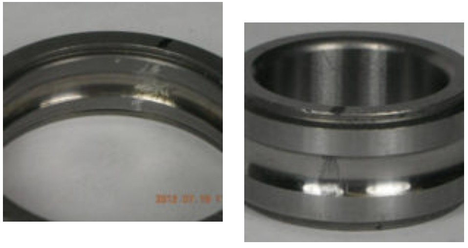

# MFPT bearing data set description

## 1 Overview

  Provided by the American Society for Mechanical Failure Prevention Technology, Dr. Eric Bechhoefer, chief engineer of NRG Systems, assembled and prepared the data on behalf of the MFPT, and has provided bearing failure data sets to facilitate research in bearing analysis.
  This data set includes data from the bearing test bench:
  - Normal bearing data
  - Outer ring fault data under different loads
  - Inner ring fault data under different loads
  - And three real failure case data
 

Dr. Eric Bechhoefer, Chief Engineer of NRG Systems, assembled and prepared the data on behalf of the MFPT.
* Data link: (https://mfpt.org/fault-data-sets/)
* Acoustics and vibration database link (http://data-acoustics.com/measurements/bearing-faults/bearing-2/)
* MATLAB documentation for troubleshooting examples of MFPT bearing data.
Connect (https://ww2.mathworks.cn/help/predmaint/examples/Rolling-Element-Bearing-Fault-Diagnosis.html)
This dataset is used less than CWRU. Updated in 2012.

## 2. Test description
The test rig was equipped with a NICE bearing with the following parameters:

- Roller diameter: rd = 0.235
- Pitch diameter: pd = 1.245
- Number of elements: ne = 8
- Contact angle: ca = 0

The data set1,2 includes the following, and can be downloaded as a zip file package he: Fault Data Sets

- 3 baseline conditions: 270 lbs of load, input shaft rate of 25 Hz, sample rate of 97,656 sps, for 6 seconds
- 3 outer race fault conditions: 270 lbs of load, input shaft rate of 25 Hz, sample rate of 97,656 sps for 6 seconds
- 7 outer race fault conditions: 25, 50, 100, 150, 200, 250 and 300 lbs of load, input shaft rate 25 Hz, sample rate of 48,828 sps for 3 seconds (bearing resonance was found be less than 20 kHz)
- 7 inner race fault conditions: 0, 50, 100, 150, 200, 250 and 300 lbs of load, input shaft rate of 25 Hz, sample rate of 48,828 sps for 3 seconds
- 5 data analysis (.m) files that relate to Eric Bechhoefer ’s introductory paper referred to below
- Three2 real world example files are also included: an intermediate shaft bearing from a wind turbine (data structure holds bearing rates and shaft rate), an oil pump shaft bearing from a wind turbine, and a real world planet bearing fault).

- Note1: The data is stored in a Matlab® double-precision, binary format * .mat file. The data structure holds the load, shaft rate, sample rate and a vector of “g” data.

- Note2: The initial data uploaded to the website in October 2012 included errors, in that the sample rate was defined as 50 Hz, when in fact it was 25 Hz. New data sets correcting this error were uploaded on 27 Feb 13. In addition , a third real world example was added]

## 3.Usage
* Lee D, Siu V, Cruz R, et al. Convolutional neural net and bearing fault analysis [C] // Proceedings of the International Conference on Data Mining (DMIN). The Steering Committee of The World Congress in Computer Science, Computer Engineering and Applied Computing (WorldComp), 2016: 194. [Paper link] (https://pdfs.semanticscholar.org/6e45/f39b1e50cfd10deaabd1d786fac827c3543a.pdf)

* Lessmeier C, Kimotho JK, Zimmer D, et al. Condition monitoring of bearing damage in electromechanical drive systems by using motor current signals of electric motors: A benchmark data set for data-driven classification [C] // Proceedings of the European conference of the prognostics and health management society. 2016: 05-08.07. [Paper link] (https://pdfs.semanticscholar.org/79c0/7f2be8dd894deb572070f674e514d3dd1caa.pdf)
Monitoring motor bearing damage with electromechanical current signals: a benchmark dataset for data-driven classification
CWRU: Bearing Data Center / Seeded Fault Test Data, FEMTO Bearing Data Set, MFPT Fault Data Sets, and Bearing Data Set IMS are analyzed and introduced.

* Verstraete D, Ferrada A, Droguett EL, et al. Deep learning enabled fault diagnosis using time-frequency image analysis of rolling element bearings [J]. Shock and Vibration, 2017, 2017. [Paper link] (https: // www .hindawi.com / journals / sv / 2017/5067651 / abs /)
Fault diagnosis is realized through deep learning of time-frequency image analysis of rolling bearings

* Yu H, Wang K, Li Y. Multiscale Representations Fusion With Joint Multiple Reconstructions Autoencoder for Intelligent Fault Diagnosis [J]. IEEE Signal Processing Letters, 2018, 25 (12): 1880-1884. [Paper link] (https: / /ieeexplore.ieee.org/abstract/document/8513874)

* Sobie C, Freitas C, Nicolai M. Simulation-driven machine learning: Bearing fault classification [J]. Mechanical Systems and Signal Processing, 2018, 99: 403-419. [Paper link] (https: //www.sciencedirect. com / science / article / pii / S0888327017303357)

* Li H, Zhao J, Liu J, et al. Application of empirical mode decomposition and Euclidean distance technique for feature selection and fault diagnosis of planetary gearbox [J]. Journal of Vibroengineering, 2016, 18 (8). [Paper link] (http://web.b.ebscohost.com/ehost/detail/detail?vid=0&sid=8cbc911d-7aff-49ef-8ba4-b2665a2fcf1f%40pdc-v-sessmgr03&bdata=Jmxhbmc9emgtY24mc2l0ZT1laG9zdC1sa120#522

* Barbini L, Ompusunggu AP, Hillis AJ, et al. Phase editing as a signal pre-processing step for automated bearing fault detection [J]. Mechanical Systems and Signal Processing, 2017, 91: 407-421. [Paper link] ( (https://www.sciencedirect.com/science/article/pii/S0888327016305192#b0095)

## 4.Data Features

[<< back to home directory](../README.md)